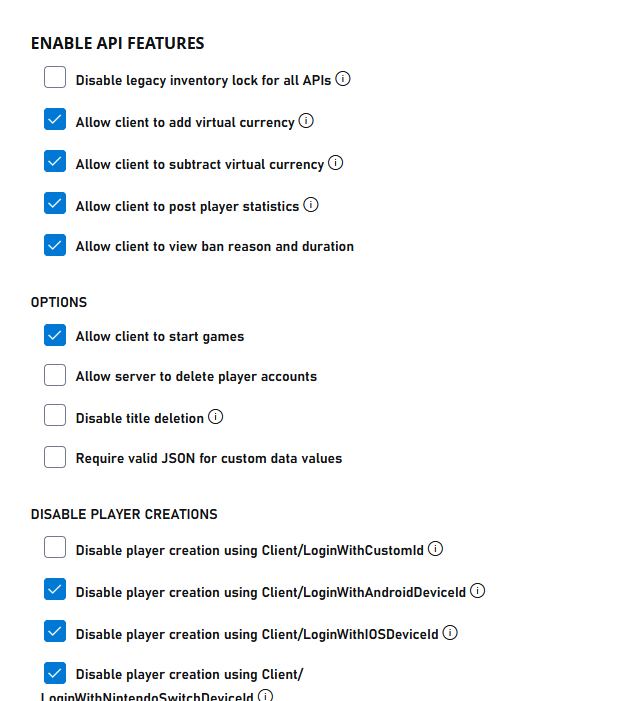
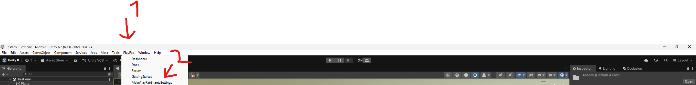

# PlayFab-Login-System
A login system for VR games made for Oculus Quest.

# Dependencies

- [The PlayFab Unity SDK](https://github.com/PlayFab/UnitySDK) [(Download)](https://aka.ms/PlayFabUnitySdk)
- [Photon VR (I used my forked version of it but I don't think it will be necessary to use it)](https://github.com/fchb1239/PhotonVR) [Forked version](https://github.com/TMTimeVR/PhotonVR)
- [The Meta XR All-in-One SDK](https://assetstore.unity.com/packages/tools/integration/meta-xr-all-in-one-sdk-269657)
- TextMeshPro
- [Glitched Cat Studios's Wardrobe System](https://github.com/Glitched-Cat-Studios/GCS-Wardrobe)

# DISCLAIMER:

**Yes, AI (Claude) was used in this system. Claude was used as a second pair of eyes, not just something that generates code that I instantly put into this system.**
I have absolutely no idea if this is a safe and secure way to do authentication. This is an older version of the backend in [Monkey Mall](https://www.meta.com/en-gb/experiences/chimpstitute/6878051502218331/).

# Credits:

I used large code snippets of SolarisDev09's [AdvancedPlayFab](https://github.com/SolarisDev09/AdvancedPlayfab?tab=readme-ov-file) and JokerJosh0's [EasyPlayFab](https://github.com/JokerJosh0/EasyPlayfab).
I also used [some random PlayFab login script from 2023](https://github.com/TMTimeVR/PlayFab-Login-System/blob/main/SomeRandomPlayFabLoginScriptFrom2023.cs). I think it was made by someone called "MONKI".

The APK hash verification code snippet (line 901 - 930) was made by . .mp4).

# Setup:

1. **Import the dependencies.** Import the PlayFab Unity SDK, Photon PUN, Photon Voice, PhotonVR, the GCS Wardrobe System and the Meta XR All-in-One SDK. If you are prompted to import TextMeshPro, do so.

2. **Add the scripts.** Place [`main/LoginPF.cs`](main/LoginPF.cs) in your project (e.g. `Assets/Scripts/`). The `creditsURL`, `motdURL`, `uURL`, `ltURL` and `woURL` fields near the top of the script point to placeholder URLs (`YOUR_USERNAME/YOUR_REPO`) — change them to your own remote text files, or remove the features that use them if you don't need a MOTD / credits / version gate.

3. **Enable the PlayFab API features.** In the PlayFab Game Manager, open **Settings → API Features**:

   

   Enable the options shown here:

   

4. **Set your Title ID.** In Unity, click **PlayFab → MakePlayFabSharedSettings** at the top of the window and enter your Title ID:

   

5. **Upload the Cloud Script.** `LoginPF.cs` relies on server-side handlers (`VOI`, `GetPhotonAuth`, `AnnounceLogin`, `banPlayer`, `permBanPlayer`, and more). In the Game Manager, go to **Automation → Cloud Script**, paste the contents of [`main/cloudscripts.js`](main/cloudscripts.js) into a new revision, save it, and **deploy it as the live revision**.

6. **Configure your secrets in Internal Title Data.** The Cloud Script reads every secret and endpoint from **server-only Internal Title Data** — never put these in client-readable Title Data or hard-code them in the scripts. In the Game Manager, open **Content → Title Data → Internal Title Data** and add the keys you need:

   | Key | Purpose |
   |-----|---------|
   | `PUN` | Photon Realtime AppId (base64-encoded) |
   | `VOICE` | Photon Voice AppId (base64-encoded) |
   | `APP_ID` | Meta/Oculus application ID |
   | `APP_SECRET` | Meta/Oculus application secret |
   | `MODERATOR_IDS` | JSON array of moderator PlayFab IDs, e.g. `["ABC123","DEF456"]` |
   | `WEBHOOK_BANS`, `WEBHOOK_VOICE`, `WEBHOOK_WARNINGS`, `WEBHOOK_REPORTS`, `WEBHOOK_LOGIN`, `WEBHOOK_LOBBY` | Notification endpoints (optional — handlers degrade gracefully if a key is unset) |
   | `META_HASH`, `IL2CPP_HASH` | Expected build hashes for the optional binary-integrity check (optional) |

7. **Set up the GCS Wardrobe.** Follow the [GCS Wardrobe setup guide](guide/GCSWARDROBETUTORIAL.mp4) (made by The Tech Wizard).

8. **(Optional) Enable the APK signature check.** `LoginPF.cs` has an `EXPECTED_SIGNATURE_HASH` constant. While it is left at `0` the check is disabled and the game runs normally. To enable it, set it to your release keystore signature's `hashCode` (see [MaxNiftyNine's guide](guide/How%20to%20add%20anticheat%20to%20your%20gorilla%20tag%20fan%20game%20%28stop%20moddinghacking%29.mp4)). This is a client-side check and only a speed bump — it can be patched out of a decompiled APK, so never rely on it as your only protection.

> **Security note:** This is client code and cannot be trusted. Keep all secrets in Internal Title Data, and enforce anything that matters — identity validation, currency/purchase grants, bans — inside Cloud Script, never on the client.
